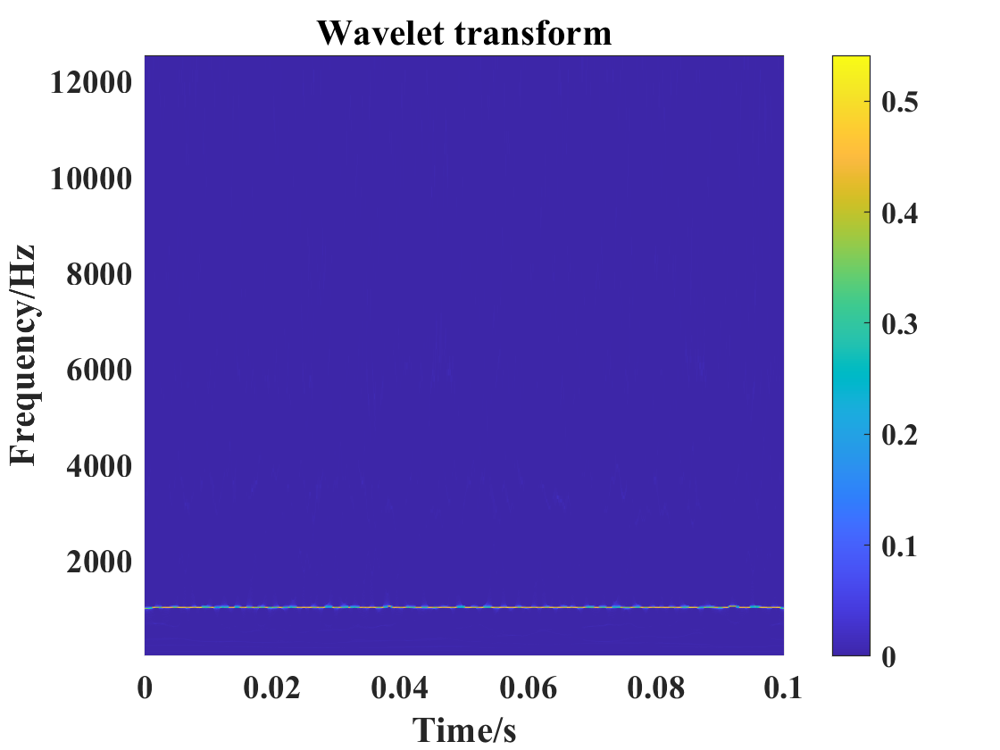

# README

The code of MATLAB for frequency-domain diagrams of article `Ultrafast piezocapacitive soft pressure sensors with over 10 kHz bandwidth via bonded microstructured interfaces`.

## 1. System requirements

The Matlab script primarily focuses on data import, signal processing, and wavelet-based time-frequency analysis.  It can run on any operating system equipped with Matlab and the following dependencies:

#### Dependencies

- Matlab Signal Processing Toolbox version 9.0
- Wavelet Toolbox version 6.1

## 2. Installation guide

You need to download the source code from this repository and install Matlab and its corresponding dependencies. The typical install time on a "normal" desktop computer takes about 10 minutes.

## 3. Demo

The `code` folder contains Matlab code, while the `data` folder contains the data required for running.

#### Functionality Breakdown

1. **Data Import**: Reads time and amplitude from a text file.
2. **Data Preprocessing**: Prepares data for FFT analysis.
3. **Fourier Analysis**: Executes FFT and visualizes amplitude spectrum.
4. **WSST Analysis**: Performs Wavelet Synchrosqueezed Transform for time-frequency representation.
5. **Data Visualization**: Plots processed data and WSST results.

#### Usage

The script can be run in a Matlab environment. To use this demo, you need to run the `wavelet_transformation.m` code in the `code` folder. Make sure to place the `1000Hz.txt` file in the `data` folder. 

#### Expected output

The expected wavelet transform results are shown as follows.  The expected run time for demo on a "normal" desktop computer is about 0.27 seconds.

## 4. Instructions for use

The default input file for the code is `1000Hz.txt`. To run the code on your data, you need to place your data files in the `data` folder and modify the variable `file_path` in the Matlab code `wavelet_transformation.m`. 
